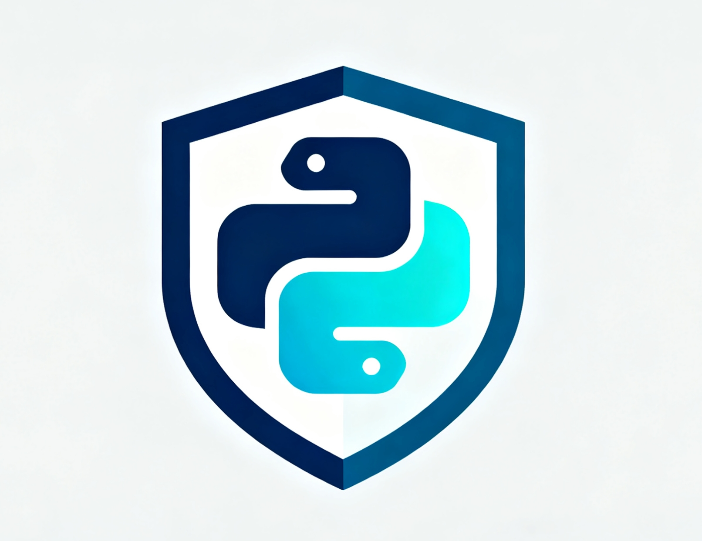

<div style="text-align: center; margin: 2em 0 1.5em 0;">
  
</div>

<div style="text-align: center; margin-bottom: 2em;">
  <h1 style="font-size: 2.5em; margin-bottom: 0.2em; color: #2c3e50;">pyobfus</h1>
  <p style="font-size: 1.3em; color: #34495e; margin-top: 0;">Modern Python Code Obfuscator</p>
  <p style="font-size: 1em; color: #7f8c8d; max-width: 600px; margin: 1em auto;">A Python code obfuscator built with AST-based transformations for Python 3.8+. Provides reliable name mangling, string encoding, and code protection features.</p>
</div>

## Features

<div style="display: grid; gap: 1.5em; margin: 1.5em 0;">

<div style="background: #f8f9fa; padding: 1.5em; border-radius: 8px; border-left: 4px solid #27ae60;">
  <h3 style="margin-top: 0; color: #27ae60;">🆓 Community Edition (Free)</h3>
  <ul style="color: #555; line-height: 1.8; margin-bottom: 0;">
    <li><strong>Name Obfuscation</strong>: Rename variables, functions, and classes to I0, I1, I2...</li>
    <li><strong>Comment Removal</strong>: Strip comments and docstrings</li>
    <li><strong>String Encoding</strong>: Base64 encoding for string literals</li>
    <li><strong>Multi-file Support</strong>: Obfuscate entire projects</li>
    <li><strong>YAML Configuration</strong>: Flexible configuration system</li>
    <li><strong>Parameter Preservation</strong>: Keep function parameter names for keyword arguments</li>
  </ul>
</div>

<div style="background: linear-gradient(135deg, #667eea 0%, #764ba2 100%); padding: 1.5em; border-radius: 8px; color: white;">
  <h3 style="margin-top: 0; color: white;">💎 Professional Edition - $45 USD</h3>
  <ul style="list-style: none; padding-left: 0; margin: 0.5em 0;">
    <li style="margin: 0.5em 0;">✨ <strong>All Community Features</strong> +</li>
    <li style="margin: 0.5em 0;">🔀 <strong>Control Flow Flattening</strong>: Transform code structure into state machines</li>
    <li style="margin: 0.5em 0;">🔐 <strong>AES-256 String Encryption</strong>: Military-grade encryption for strings</li>
    <li style="margin: 0.5em 0;">🛡️ <strong>Anti-Debugging Checks</strong>: Detect and prevent debugging attempts</li>
    <li style="margin: 0.5em 0;">🔄 <strong>Lifetime Updates</strong>: All future Pro features included</li>
    <li style="margin: 0.5em 0;">💻 <strong>Up to 3 Devices</strong>: Use on multiple machines</li>
    <li style="margin: 0.5em 0;">📧 <strong>Priority Email Support</strong></li>
  </ul>
  <div style="text-align: center; margin-top: 1.5em;">
    <a href="https://buy.stripe.com/00w4gr8ta9F78Fj8oI9k400" style="display: inline-block; background: white; color: #667eea; padding: 12px 32px; border-radius: 6px; text-decoration: none; font-weight: bold; font-size: 16px; box-shadow: 0 2px 4px rgba(0,0,0,0.2);">Buy Now - $45 USD →</a>
  </div>
</div>

</div>

<p style="text-align: center; font-size: 0.9em; color: #7f8c8d; margin-top: 1em;"><a href="#purchase-professional-edition" style="color: #3498db; text-decoration: none;">📄 More purchase details ↓</a></p>

## Installation

**From PyPI** (recommended):

```bash
pip install pyobfus
```

**From source** (for development):

```bash
git clone https://github.com/zhurong2020/pyobfus.git
cd pyobfus
pip install -e .
```

## Quick Start

Obfuscate a single file:

```bash
pyobfus input.py -o output.py
```

Obfuscate a directory:

```bash
pyobfus src/ -o obfuscated/
```

With configuration:

```bash
pyobfus src/ -o obfuscated/ --config pyobfus.yaml
```

## Example

**Before obfuscation:**

```python
def calculate_total(price, quantity):
    """Calculate total price."""
    tax_rate = 0.1
    subtotal = price * quantity
    tax = subtotal * tax_rate
    return subtotal + tax
```

**After obfuscation:**

```python
def I0(I1, I2):
    I3 = 0.1
    I4 = I1 * I2
    I5 = I4 * I3
    return I4 + I5
```

*Note: Variable names may vary slightly, but functionality is preserved.*

## Documentation

- [README](https://github.com/zhurong2020/pyobfus#readme) - Full documentation
- [Roadmap](https://github.com/zhurong2020/pyobfus/blob/main/ROADMAP.md) - Future features
- [Changelog](https://github.com/zhurong2020/pyobfus/blob/main/CHANGELOG.md) - Version history
- [Security Policy](https://github.com/zhurong2020/pyobfus/blob/main/SECURITY.md) - Report vulnerabilities

## Community & Support

- [GitHub Issues](https://github.com/zhurong2020/pyobfus/issues) - Bug reports and feature requests
- [GitHub Discussions](https://github.com/zhurong2020/pyobfus/discussions) - Questions and ideas
- [Contributing](https://github.com/zhurong2020/pyobfus/blob/main/CONTRIBUTING.md) - How to contribute

## Purchase Professional Edition

<div style="background: #f8f9fa; padding: 2em; border-radius: 8px; border-left: 4px solid #667eea; margin: 1.5em 0;">
  <h3 style="margin-top: 0; color: #2c3e50;">💎 Professional Edition - $45 USD</h3>
  <p style="color: #7f8c8d; font-size: 0.95em;">One-time payment • Lifetime access</p>

  <h4 style="color: #34495e; margin-top: 1.5em;">What's Included:</h4>
  <ul style="color: #555; line-height: 1.8;">
    <li>✅ <strong>Control Flow Flattening</strong> - State machine transformation</li>
    <li>✅ <strong>AES-256 String Encryption</strong></li>
    <li>✅ <strong>Anti-Debugging Checks</strong></li>
    <li>✅ <strong>Lifetime Updates</strong></li>
    <li>✅ <strong>Up to 3 Devices</strong></li>
    <li>✅ <strong>Email Support</strong> (zhurong0525@gmail.com)</li>
  </ul>

  <div style="text-align: center; margin: 1.5em 0;">
    <a href="https://buy.stripe.com/00w4gr8ta9F78Fj8oI9k400" style="display: inline-block; background: linear-gradient(135deg, #667eea 0%, #764ba2 100%); color: white; padding: 14px 40px; border-radius: 6px; text-decoration: none; font-weight: bold; font-size: 17px; box-shadow: 0 3px 6px rgba(102, 126, 234, 0.3); transition: all 0.3s;">🚀 Buy Now - $45 USD</a>
    <p style="margin-top: 1em; color: #7f8c8d; font-size: 0.9em;">⚡ Instant delivery • 🔒 Secure checkout • 💯 30-day money-back guarantee</p>
  </div>
</div>

### Try Before You Buy

Want to test Pro features before purchasing? Use the **5-day free trial**:

```bash
# Start a free trial (no credit card required)
pyobfus-trial start --email your@email.com

# Test Pro features
pyobfus input.py -o output.py --control-flow --string-encryption --anti-debug

# Check trial status
pyobfus-trial status
```

The trial includes all Pro features with full functionality for 5 days.

### How to Purchase

**Step 1**: Click "Buy Now" and complete secure checkout (Stripe)

**Step 2**: Receive your license key via email within minutes

**Step 3**: Activate your license
```bash
pip install --upgrade pyobfus
pyobfus-license register PYOB-XXXX-XXXX-XXXX-XXXX
```

### Activation Guide
Full activation instructions: [License Activation Guide](https://github.com/zhurong2020/pyobfus/blob/main/docs/LICENSE_ACTIVATION_GUIDE.md)

### Legal & Policies

By purchasing pyobfus Professional Edition, you agree to our:
- [Terms of Service & EULA](https://github.com/zhurong2020/pyobfus/blob/main/docs/legal/TERMS_OF_SERVICE.md)
- [Refund Policy](https://github.com/zhurong2020/pyobfus/blob/main/docs/legal/REFUND_POLICY.md) - 30-day money-back guarantee
- [Privacy Policy](https://github.com/zhurong2020/pyobfus/blob/main/docs/legal/PRIVACY_POLICY.md) - GDPR compliant

---

## License

Apache License 2.0 - See [LICENSE](https://github.com/zhurong2020/pyobfus/blob/main/LICENSE)

---

**Built with Python 3.8+ • AST-based Transformations • Open Source**
