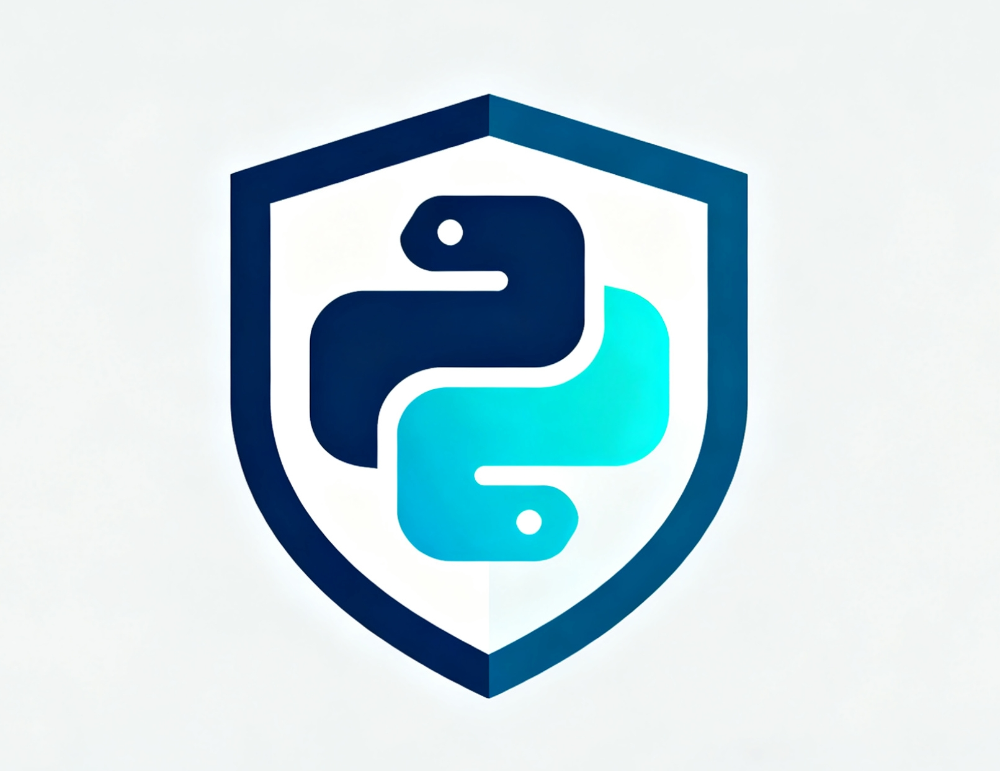

<div style="text-align:center;margin:2em 0">
  
  <h1>pyobfus documentation</h1>
  <p style="font-size:1.2em;max-width:680px;margin:0 auto">Protect Python before shipping, verify what was produced, and keep production failures diagnosable.</p>
</div>

pyobfus is a local-first, AST-based Python obfuscator for Python 3.9–3.14.
Community is Apache-2.0, has no file or line limits, and requires no trial.

[简体中文概览](https://github.com/zhurong2020/pyobfus/blob/main/README.zh-CN.md)

## Start here

| Task | Go to |
|---|---|
| Install and protect a project | [Quick start](#quick-start) |
| See a minimal before/after transformation | [Canonical README example](https://github.com/zhurong2020/pyobfus#minimal-example) |
| Find risks before changing code | [`--check` and SARIF](SARIF_CODE_SCANNING.md) |
| Preview exactly what a build will select | [Structured dry-run and build evidence](VERIFIABLE_BUILD_REPORT.md) |
| Verify and retain build evidence | [Verifiable build report](VERIFIABLE_BUILD_REPORT.md) and [provenance manifest](PROVENANCE_MANIFEST.md) |
| Debug an obfuscated production traceback | [README traceback workflow](https://github.com/zhurong2020/pyobfus#how-do-i-debug-an-obfuscated-crash-with-an-ai-assistant) |
| Package or integrate the result | [PyInstaller](PYINSTALLER_COOKBOOK.md), [compiled packaging](COMPILED_PACKAGING_COOKBOOK.md), or [integration testing](INTEGRATION_TESTING.md) |
| Choose Community or Pro | [Edition boundary](EDITION_BOUNDARY_POLICY.md) and [comparison overview](COMPARISON.md) |

## Quick start

```bash
pip install pyobfus

# Check first, then preview without writing
pyobfus --check src/
pyobfus src/ -o dist/ --dry-run --json

# Build, keep the private mapping, and verify generated syntax
pyobfus src/ -o dist/ --save-mapping mapping.json --verify-syntax
# --verify-syntax only compiles the output; run your own tests against dist/
```

When a production traceback arrives:

```bash
pyobfus --unmap --trace error.log --mapping mapping.json
```

The mapping stays with the developer; it is not part of the customer artifact.

## Choose an edition

### Community

Community provides the complete local workflow: project-wide AST obfuscation,
framework-aware presets, pre-flight scanning, SARIF, dry-run, mapping/unmapping,
syntax verification, provenance, reproducible output and build reports. It has
no product-imposed project-size limit.

### Professional

Professional adds commercial value in four groups:

- **Protection strength:** encryption, flattening, anti-debugging, opacity and sealing.
- **Protected assets:** import strings, embedded data, vault secrets and tracebacks.
- **Distribution control:** device, expiry, run, platform and supplied-key policies.
- **Accountability:** forensic watermarking and buyer-specific builds.

Community helps reliably obfuscate, inspect, verify and debug; Pro helps protect
commercial IP, constrain artifact execution and trace leaks. See the
[edition-boundary policy](EDITION_BOUNDARY_POLICY.md) for future-feature decisions.

To evaluate Pro without registration or a credit card:

```bash
pyobfus-trial start
```

The five-day trial is an honor-system convenience control, not a security
boundary. For current pricing, purchase details and payment methods, use the
[product page](https://zhurong2020.github.io/pyobfus/#purchase-professional-edition).
After purchase, follow the [license activation guide](LICENSE_ACTIVATION_GUIDE.md).

## Integrate with your workflow

- **GitHub Actions:** `uses: zhurong2020/pyobfus-action@v1` for scanning or builds with SARIF.
- **AI agents:** install `pyobfus-mcp`, or use the repository's review/protect skills.
- **Editors:** use the VS Code Marketplace or Open VSX extension for diagnostics and traceback reversal.
- **Automation:** every CLI mode supports a stable JSON envelope with an `ai_hint` next action.

See the [project structure](PROJECT_STRUCTURE.md) for package and repository
ownership, including the separately distributable `pyobfus-runtime` required by
runtime-backed Pro artifacts.

## Verify claims and understand limits

- [Support matrix](SUPPORT_MATRIX.md): tested, verified-once and advisory-only claims.
- [Threat model](THREAT_MODEL.md): what obfuscation can and cannot protect.
- [Release provenance](RELEASE_PROVENANCE_VERIFICATION.md): PyPI PEP 740 attestations.
- [Supply-chain assurance](SUPPLY_CHAIN_ASSURANCE.md): provenance and SBOM scope.
- [Comparisons](COMPARISON.md): where alternatives are stronger and when to combine tools.

Client-side obfuscation raises analysis cost; it cannot make secrets or Python
logic irrecoverable. Keep credentials in environment variables or an external
secret manager, and keep security decisions behind a server boundary.

## Community and source

- [GitHub repository](https://github.com/zhurong2020/pyobfus)
- [Issues](https://github.com/zhurong2020/pyobfus/issues) and [Discussions](https://github.com/zhurong2020/pyobfus/discussions)
- [Contributing guide](https://github.com/zhurong2020/pyobfus/blob/main/CONTRIBUTING.md)
- [Security policy](https://github.com/zhurong2020/pyobfus/blob/main/SECURITY.md)
- [Changelog](https://github.com/zhurong2020/pyobfus/blob/main/CHANGELOG.md)

Core is licensed under Apache-2.0; Professional implementation is proprietary.
